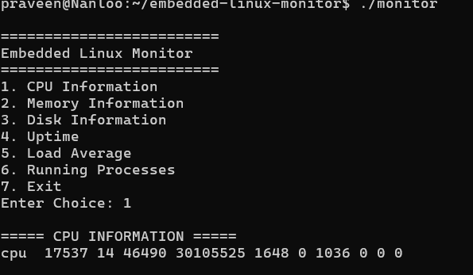
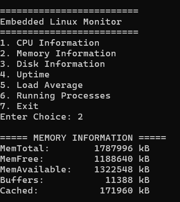
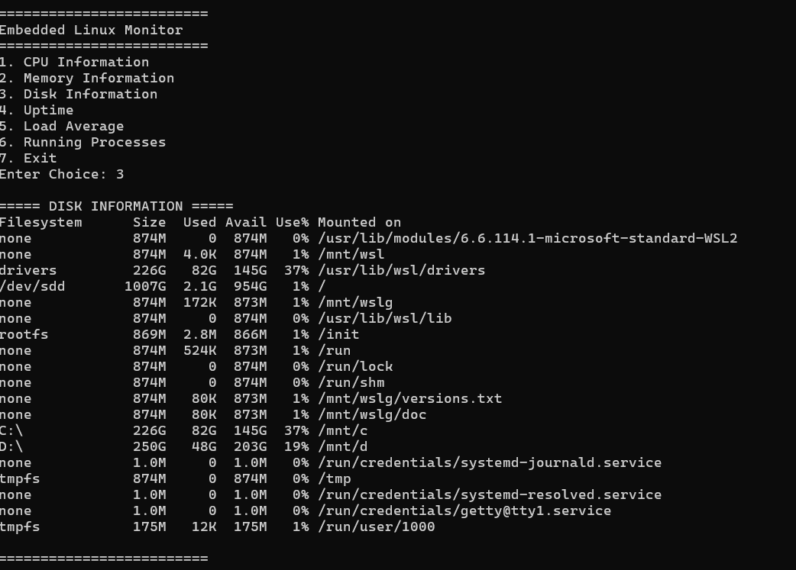
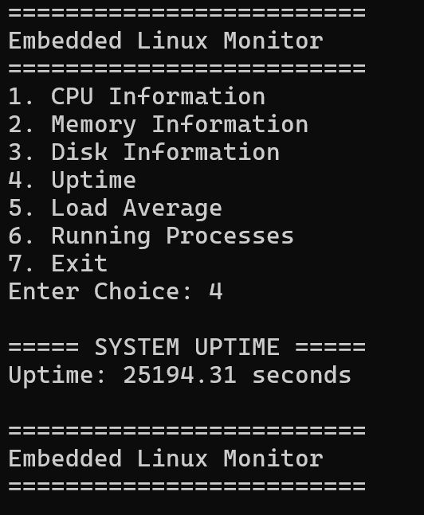
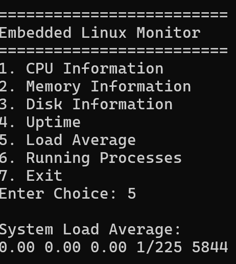
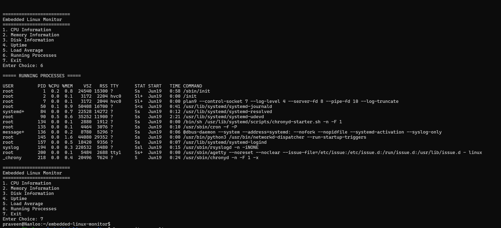

# Embedded Linux Resource Monitor


## Overview

Embedded Linux Resource Monitor is a modular system monitoring application developed in the C programming language for Linux-based environments. The project is designed to provide real-time insights into system resources by collecting and displaying information from the Linux `/proc` virtual filesystem.

The application demonstrates core Embedded Linux concepts such as Linux file handling, process monitoring, system resource management, modular programming, Makefile-based builds, and Git version control. It serves as a practical learning project for understanding how Linux exposes system information and how embedded software engineers interact with operating system resources.

## Objectives

The primary objective of this project is to gain hands-on experience with:

* Embedded Linux development
* Linux system programming in C
* Working with the `/proc` filesystem
* Modular software architecture
* Build automation using Makefiles
* Version control using Git and GitHub
* Reading and processing system information from the Linux kernel

## Features

### CPU Information Monitoring
Displays processor-related information obtained from Linux system files.

### Memory Monitoring
Displays memory statistics including total memory, available memory, and usage information.

### Disk Information Monitoring
Retrieves and displays disk-related information for storage analysis.

### System Uptime Monitoring
Reads system uptime information and displays how long the system has been running.

### Load Average Monitoring
Reads data from `/proc/loadavg` to display system load averages and overall workload.

### Process Monitoring
Provides process-related information to help understand running tasks and system activity.

## Project Architecture

The project follows a modular architecture where each functionality is implemented in a separate source file.

```text
Embedded_Linux_Resource_Monitor/
│
├── include/
│   └── monitor.h
│
├── src/
│   ├── main.c
│   ├── cpu.c
│   ├── memory.c
│   ├── disk.c
│   ├── uptime.c
│   └── loadavg.c
│
├── screenshots/
│   ├── cpu-info.png
│   ├── memory-usage.png
│   ├── disk-info.png
│   ├── system-uptime.png
│   ├── system-load-average.png
│   └── process-monitoring.png
│
├── Makefile
└── README.md
```

## Technologies Used

* C Programming Language
* Linux Operating System
* Embedded Linux Concepts
* Linux `/proc` Filesystem
* GCC Compiler
* Makefile
* Git
* GitHub
* Ubuntu (WSL)

## Build Instructions

Clone the repository:

```bash
git clone git@github.com:Praveennanloo/Embedded_Linux_Resource_Monitor.git
cd Embedded_Linux_Resource_Monitor
```

Compile the project:

```bash
make
```

Clean build files:

```bash
make clean
```

## Running the Application

After successful compilation:

```bash
./monitor
```

The application displays a menu-driven interface that allows users to select various system monitoring options:
     === Embedded Linux Resource Monitor ===

        1.CPU Information
        2.Memory Information
        3.Disk Information
        4.System Uptime
        5.Load Average
        6.Running Processes
        7.Exit


## Learning Outcomes

Through this project, the following skills were developed:

* Linux command-line proficiency
* C programming fundamentals
* Function-based modular design
* Header file management
* Multi-file project development
* Compilation and linking process
* Debugging compiler and linker errors
* Git and GitHub workflow
* SSH authentication setup for GitHub
* Linux system resource monitoring techniques

## Future Enhancements

Planned improvements include:

* CPU usage percentage calculation
* Memory utilization percentage
* Advanced process monitoring
* Logging system statistics to files
* Colorized terminal output
* Interactive terminal dashboard using ncurses
* Multi-threaded monitoring support
* Exporting monitoring reports

## Screenshots

### CPU Information


### Memory Information


### Disk Information


### System Uptime


### Load Average


### Running Processes


## License

This project is licensed under the MIT License.

## Author

**Praveen Bolla**

Aspiring Embedded Linux Engineer with hands-on experience in Linux system programming, C programming, Git, GitHub, and Embedded Software Development.

GitHub: https://github.com/Praveennanloo
